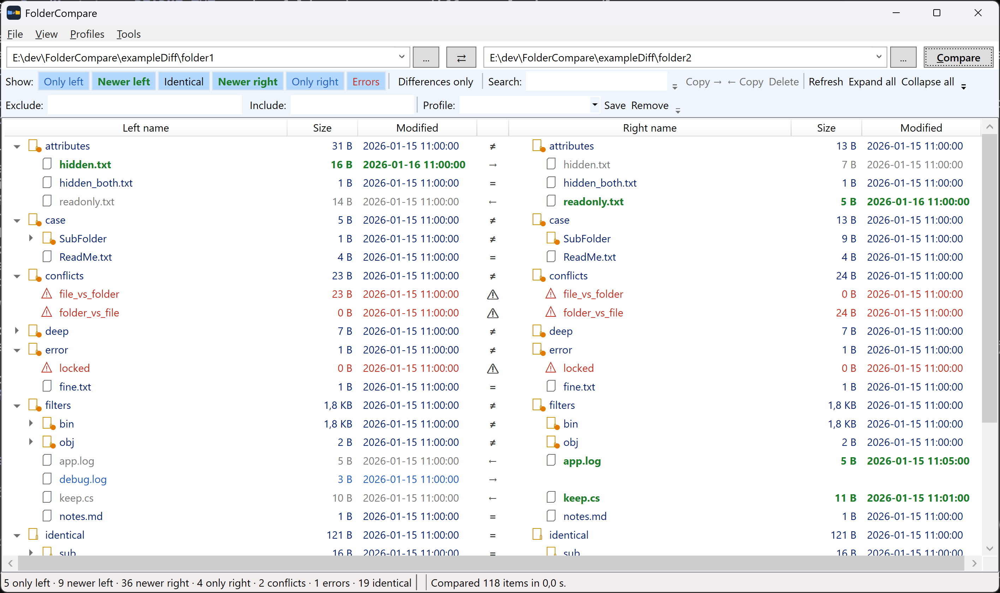
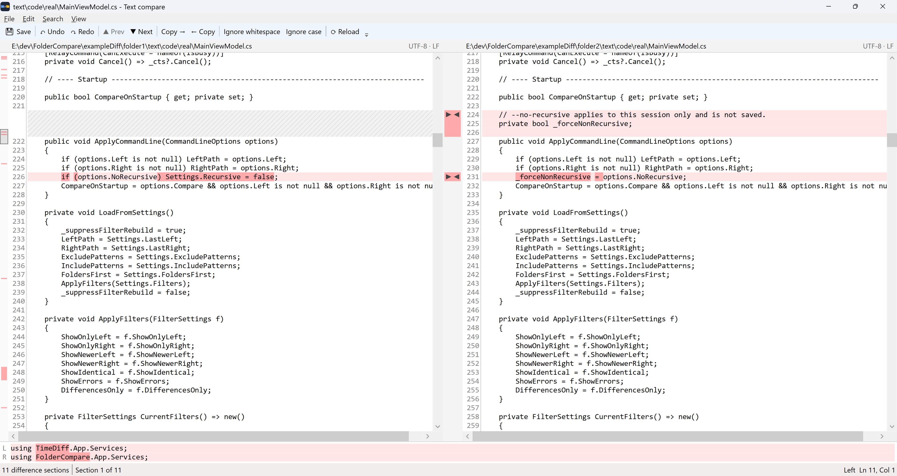

# FolderCompare

A fast, portable, safety-first folder comparison tool for Windows.

[](https://github.com/darkcoder2000/FolderCompare/releases/latest)
[](LICENSE)


FolderCompare compares two directory trees **by last-write timestamp only**, shows the result side by side, and lets
you copy, delete or rename items from a right-click menu or the keyboard.



<!--  -->

## Download

Get `FolderCompare.exe` from the [latest release](https://github.com/darkcoder2000/FolderCompare/releases/latest)
and run it. It's a single file for Windows x64, with no installer, no admin rights and no .NET runtime needed.

## Why FolderCompare?

* **Portable single exe.** Nothing to install, no admin rights, no .NET runtime.
* **Fast on large trees.** It compares timestamps only and never reads file contents during a scan.
* **Timestamp tolerance.** Configurable tolerance (default 2 s) and an optional 1-hour DST tolerance for NTFS vs.
  FAT/exFAT/NAS copies.
* **Safety-first file operations.** Copies use a temp file and rename, targets are checked against the root, deletes
  go to the Recycle Bin, and every operation is logged.
* **Built-in text diff.** Side-by-side, word-level highlights, editable panes, and the file's encoding and line
  endings are kept when you save.

## Quick start

1. Pick the left and right folders (type a path, use *...*, or choose a recent one) and press **Compare** (F5).
2. Use the *Show* buttons to filter by status. *Differences only* hides identical items.
3. Select items and copy them with Ctrl+Right / Ctrl+Left, or right-click for copy, delete and rename.
4. Double-click a file to compare its contents.

### Command line

```
FolderCompare.exe "C:\A" "D:\B" [--compare] [--no-recursive]
```

`--compare` starts the comparison immediately. `--no-recursive` compares only the top level for this session.

### Explorer context menu

Turn on *Tools → Explorer context menu integration* to add two entries to the right-click menu of files and
folders in Windows Explorer:

1. **Select as left for FolderCompare** remembers the item (no window opens).
2. **Compare to "…" with FolderCompare** compares the remembered item with the one you right-clicked. Two folders
   open the main window and compare at once. Two files open the text compare window.

The entries are registered for the current user only (no admin rights) and point to the exe's current location.
If you move the exe, start it once and the entries are updated. Uncheck the menu item to remove them again.
On Windows 11 they appear under *Show more options* (or Shift+F10).

## How it compares

* Files: last write time (UTC). Within the tolerance (default 2 s) they count as identical. Optionally, a
  difference of exactly 1 hour (± tolerance) is ignored (DST). Size is shown but not compared.
* Statuses: only left, only right, newer left, newer right, identical, type conflict (file vs. folder), error.
* Folders roll up: `=` only when everything inside is identical, otherwise `≠` (folder icon gets an orange dot).
* Paths match case-insensitively. Long paths and Unicode are supported. Unreadable folders are marked as errors
  and the scan continues.
* Symbolic links and junctions are skipped by default. If you choose *Follow*, loops are detected.
* In non-recursive mode, sub-folders that exist on both sides are shown without contents and marked `=`.

## Safety

* Scanning never modifies anything.
* Every copy and delete target is checked to be strictly inside the chosen root (after `GetFullPath`).
* Comparing a folder with itself, or with a folder nested inside it, is refused.
* Copies go to `<name>.tmpcopy` first and are renamed on success. Timestamps and attributes are preserved and
  verified (exists, size, timestamp). A cancelled copy leaves no partial file.
* Deletes go to the Recycle Bin by default. Permanent delete needs an extra confirmation.
* Overwriting a file that is newer than the source always asks first, with a warning.

## Keyboard

| Key | Action |
|---|---|
| F5 | Compare / rescan |
| Ctrl+Right / Ctrl+Left | Copy selection to right / left |
| Delete | Delete (asks which side if items exist on both) |
| F2 | Rename |
| Ctrl+F | Search box |
| Ctrl+A | Select all visible rows |
| Ctrl+E | Export report (CSV or text) |
| Esc | Cancel running scan / operation |
| ← / → | Collapse / expand folder (← on a collapsed row jumps to the parent) |
| Space | Toggle selection of the focused row |
| Enter / double-click | Compare contents of the selected file (folders: expand / collapse) |

<!--  -->

## Compare contents (text files)

Double-click a file row, press Enter, or use *Tools → Compare contents...* (also in the context menu) to open
the two versions side by side in a separate window. It works for any text file; binary files are refused.
A file that exists on one side only opens against an empty pane.



* Lines are aligned: where one side has extra lines, the other shows hatched filler rows.
* Red marks important differences: a light red line background, with the changed words in stronger red.
  With *Ignore whitespace* / *Ignore case* turned on, differences of only that kind turn blue and are skipped
  by navigation.
* The strip between the panes shows every difference section. Click its ▶ / ◀ arrows to copy a section to the
  other side. The bar on the far left is an overview of the whole file; click it to jump.
* Both panes are editable and are recompared as you type. Undo / redo work per pane, and each copy is one undo step.
* Saving keeps the file's encoding (UTF-8 with or without BOM, UTF-16, ANSI) and line endings. It warns if the
  file changed on disk in the meantime, and the main list rescans the file afterwards. Closing with unsaved
  changes asks first.
* The line-details area at the bottom shows the current line of both sides one above the other.

| Key | Action |
|---|---|
| Ctrl+N / Ctrl+P (Alt+Down / Alt+Up) | Next / previous difference section |
| Ctrl+R / Ctrl+L (Alt+Right / Alt+Left) | Copy the current section (or the sections in the selection) to the right / left |
| Ctrl+S / Ctrl+Shift+S | Save the focused side / both sides |
| Ctrl+Z / Ctrl+Y | Undo / redo in the focused side |
| F5 | Reload both files |
| Esc | Close the window |

## Files

* Settings: `%APPDATA%\FolderCompare\settings.json` (options, last folders, recent paths, profiles, window and columns)
* Logs: `%LOCALAPPDATA%\FolderCompare\logs` (daily, kept 14 days; every file operation is logged). Open it via *File → Open log folder*.

## Build from source

Requires the .NET 8 SDK (Windows).

```powershell
dotnet build
dotnet test
dotnet run --project src/FolderCompare.App -- "C:\A" "D:\B" --compare
```

To publish the single-file exe:

```powershell
dotnet publish src/FolderCompare.App -c Release -o publish
```

The Release configuration produces a self-contained, single-file `publish\FolderCompare.exe` (win-x64).

### Project layout

```
src/FolderCompare.Core/        comparison engine, models, file operations, text diff (no WPF dependency)
src/FolderCompare.App/         WPF app (MVVM with CommunityToolkit.Mvvm)
tests/FolderCompare.Core.Tests xUnit tests (System.IO.Abstractions mock file system + a few real-FS tests)
tools/New-ExampleDiff.ps1      creates two example folders that cover every compare case
docs/MANUAL_TESTS.md           manual test checklist
```

## Comparison with other tools

FolderCompare does one thing: quick timestamp-based folder comparison with safe copy and delete. The tools below are
mature and do much more. This table is to the best of our knowledge; please check each project's website for
current details.

| | FolderCompare | WinMerge | Beyond Compare | FreeFileSync |
|---|---|---|---|---|
| License | Free, MIT | Free, GPL | Commercial | Free, GPL |
| Platforms | Windows | Windows | Windows, macOS, Linux | Windows, macOS, Linux |
| Folder comparison | Timestamp only | Contents, size, date | Contents, size, date | Date and size, or contents |
| Text diff | Yes, two-way | Yes, two- and three-way | Yes, two- and three-way | No |
| Focus | Quick comparison, manual copy | Diff and merge | Diff and merge | Folder synchronization |

Use FolderCompare when you want a fast overview of which files differ by date and full control over each copy or delete.
If you need byte-level folder comparison, three-way merge or automatic sync, one of the other tools is a better fit.

## Roadmap

Planned:

* Dark theme / follow the system theme (colors already live in `Themes/Colors.xaml`)
* `.resx` localization
* Flat list view mode
* Rubber-band selection

Ideas, not planned yet: content/hash comparison of whole folders, three-way compare, remote locations. The engine
works on `System.IO.Abstractions.IFileSystem`, so another file-system provider can be plugged in later.

## Contributing

Bug reports, ideas and pull requests are welcome. Please open an issue first for bigger changes. Run `dotnet test`
before submitting. For UI changes, check the relevant items in [docs/MANUAL_TESTS.md](docs/MANUAL_TESTS.md).
When reporting a bug, include your Windows version, the app version and, if possible, the log file from
`%LOCALAPPDATA%\FolderCompare\logs`.

## License

FolderCompare is released under the [MIT License](LICENSE).

## Trademarks

Beyond Compare is a trademark of Scooter Software. FolderCompare is an independent project and is not affiliated
with or endorsed by Scooter Software.
